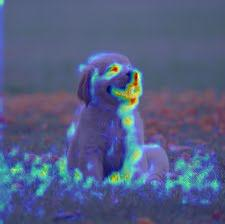

# gradcam_for_resnet

This project is designed to visualize layer outputs of ResNet models. It uses libraries [pytorch-grad-cam]{https://github.com/jacobgil/pytorch-grad-cam/tree/master} and torch.

## Installation Guide
To get a local working copy of the development repository, do:
```shell
git clone https://github.com/mkeriy/gradcam_for_resnet.git
cd gradcam_for_resnet
```
Create virtual environment:
```shell
pip install virtualenv
python -m venv <virtual-env-name>
source <virtual-env-name>/bin/activate
```
Upload the required libraries:
```shell
pip install -r requirements.txt
```
If you have problems with torch installation, try:
```shell
pip install torch --no-cache-dir
pip install -r requirements.txt
```
## Run
To run this utility:
```shell
python main.py --image-path <path> --model <resnet№> --layer <from 1 to 4> --block <number of block in layer> --output_dir <path to directory>
```
> --image-path - path to image
> 
> --model - choose one of ResNet models implemented in torch (default resnet50)
> 
> --layer - choose one of four ResNet layers, according to torch implementation (default 4)
> 
> --block - ResNet layer consists of several blocks, choose one of them (default -1, the last one)
> 
> --output-dir - path to directory in the form "./example/", where to save processed image (default ./output/)

### Example
```shell
python main.py --image-path "./image.jpeg" --model "resnet152" --layer 1 --block 0 --output_dir "./my_dir/"
```
 Input image                |  Output image
:-------------------------:|:-------------------------:
  |  
